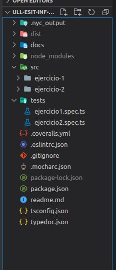

# INFORME PRACTICA 6
## Clases e interfaces genéricas. Principios SOLID
### ALBERTO RIOS DE LA ROSA
### alu0101235929@ull.edu.es

### INTRODUCCIÓN

Esta práctica tiene como objetivo principal continuar en la realización de ejercicios de programación en TypeScript, centrándonos más en ejercicios relacionados con clases e interfaces genéricas además de seguir algunos de los principios solid, para así seguir evolucionando en nuestro aprendizaje. Al igual que las anteriores practicas se deberá desarrollar la documentación y la realización de pruebas mediante la metodología TDD. Primero explicaremos en un principio como crear este método de manera breve, y más tarde mostraremos la solución de cada uno de los ejercicios propuestos, que al tener varios ficheros cada ejercicio se encontrará resuelto en una carpeta dentro de la src para cada ejercicio, con una breve explicación de cada uno y unas capturas de pantalla en el que se muestra que se han superado las distintas pruebas de ese ejercicio junto al link de donde se crearon las pruebas. Si desea leer los enunciados de cada ejercicio los podrás encontrar pinchando [aqui](https://ull-esit-inf-dsi-2021.github.io/prct06-generics-solid/).

### CREACION DEL PROYECTO CON LA ESTRUCTURA REQUERIDA

Para crear el proyecto primero debemos realizar un git clone, de la estructura de git dada para el desarrollo y la entrega del mismo, mas tarde al igual que la práctica anterior debemos seguir los pasos de la creacion de un proyecto para trabajar en TypeScript a partir del siguiente [enlace](https://ull-esit-inf-dsi-2021.github.io/typescript-theory/typescript-project-setup.html). Ya creado el proyecto inicial, lo siguiente que vamos a crear es los ficheros y carpetas necesarios para poder elaborar la documentación de cada uno de los ejercicios, encontrandolos en este [video](https://drive.google.com/file/d/19LLLCuWg7u0TjjKz9q8ZhOXgbrKtPUme/view). Después por último para ya tener la estructura de nuestro proyecto terminada, a través de mocha y chai, crearemos lo necesario para poder seguir la metodología TDD, en el que se desarrolla la prueba y luego el método, teniendolo disponible en este [video](https://drive.google.com/file/d/1-z1oNOZP70WBDyhaaUijjHvFtqd6eAmJ/view). Para hacernos una idea de la estructura final del proyecto, debe ser algo parecido a lo siguiente:

    

### ELABORACIÓN DE LOS EJERCICIOS

### Ejercicio 1 - El combate definitivo

 - ___Carpeta con el código resuelto___ = [Solución](https://github.com/ULL-ESIT-INF-DSI-2021/ull-esit-inf-dsi-20-21-prct06-generics-solid-Espinette/tree/master/src/ejercicio-1)
 
 - ___Fichero con las pruebas___ = [Pruebas](https://github.com/ULL-ESIT-INF-DSI-2021/ull-esit-inf-dsi-20-21-prct06-generics-solid-Espinette/blob/master/tests/ejercicio1.spec.ts)

 - ___Explicación de cada clase___

    1. ___Clase Fighter___:

         La clase fighter es la clase padre de este ejercicio, dicha clase es de tipo abstracto, el cual contiene los atributos básicos de los luchadores que van a competir en nuestro combate, siendo muy parecida a la clase pokemon de la practica 5. Le hemos añadido al constructor la variable coletilla que incluirá una frase del luchador, además tendremos los getters y setters de cada una de ellas, y una función llamada getUniverse() la cual la usaremos para ver a que universo pertence nuestro luchador. Encontrará la clase [aqui](https://github.com/ULL-ESIT-INF-DSI-2021/ull-esit-inf-dsi-20-21-prct06-generics-solid-Espinette/blob/master/src/ejercicio-1/fighter.ts).
         
    2. ___Clase Universos___:

         Aquí incluiremos cada uno de las clases hija de la clase fighter que son las siguientes:
         
         a. [Clase Marvel](https://github.com/ULL-ESIT-INF-DSI-2021/ull-esit-inf-dsi-20-21-prct06-generics-solid-Espinette/blob/master/src/ejercicio-1/marvel.ts)
         b. [Clase DC](https://github.com/ULL-ESIT-INF-DSI-2021/ull-esit-inf-dsi-20-21-prct06-generics-solid-Espinette/blob/master/src/ejercicio-1/dc.ts)
         c. [Clase Dragon Ball](https://github.com/ULL-ESIT-INF-DSI-2021/ull-esit-inf-dsi-20-21-prct06-generics-solid-Espinette/blob/master/src/ejercicio-1/dragonBall.ts)
         d. [Clase Star Wars](https://github.com/ULL-ESIT-INF-DSI-2021/ull-esit-inf-dsi-20-21-prct06-generics-solid-Espinette/blob/master/src/ejercicio-1/starWars.ts)
         e. [Clase Pokemon](https://github.com/ULL-ESIT-INF-DSI-2021/ull-esit-inf-dsi-20-21-prct06-generics-solid-Espinette/blob/master/src/ejercicio-1/pokemon.ts)
         
         Cada clase contará con un atributo por defecto que será el tipo de universo al que pertenece el personaje, dentro de cada una se tendrá el constructor de la clase así como una función getUniverso() que retornará el universo del personaje.
   
   3. ___Clase FighterCollection___:

         La clase FighterCollection nos sirve para almacenar todos los luchadores en un sitio, es decir, a esta clase, le podremos introducir un objeto de cualquier universo el cual se quedará almacenado en nuestro base de datos. Lo que tendrá el constructor de esta clase será un vector, el cual almacenará a todos los luchadores, pudiendo acceder a ellos o añadir otro a la base de datos. Tenemos el método getPersonajes() el cual retornará los luchadores que tenemos guardado dentro de ella, el método addFighter() el cual sirve para añadir un nuevo luchador. Y finalmente tenemos la función findFighter() para buscar un personaje dentro de la base de datos y nos dirá si se encuentra o no en ella. La clase se encuentra [aquí](https://github.com/ULL-ESIT-INF-DSI-2021/ull-esit-inf-dsi-20-21-prct06-generics-solid-Espinette/blob/master/src/ejercicio-1/fighterColleccion.ts)
         
   4. ___Clase MostrarFighterCollection___:

         Esta clase ha sido creada para cumplir con los principios Solid, por lo que su unica función será la de recibir una base de datos de personajes de distintos universos, y lo que hará será a traves de la función mostrarPersonajes() mostrar una tabla con los personajes de la base de datos. La clase desarrollada se encuentra [aquí](https://github.com/ULL-ESIT-INF-DSI-2021/ull-esit-inf-dsi-20-21-prct06-generics-solid-Espinette/blob/master/src/ejercicio-1/mostrarFighterColleccion.ts) 
         
   5. ___Clase Combat___:

         Esta clase tendrá como parámetros dos luchadores diferentes, los cuales se prestarán a hacer una simulación de combate. Para poder ver quien gana el combate, primero tendremos que ver el daño que le hace un luchador a otro, para esto hacemos uso del método dañoFighter() el cual, según el tipo de luchador que sea y a que universo pertenezca, verá la eficacia que le hace a su adversario. Esto lo hemos hecho con un switch cuyo objetivo es analizar el universo de ambos luchadores y le daremos un valor a la eficacia. Esta función tiene como resultado algo parecido a lo realizado en la P5.

Por último tenemos el método start() este método es el principal de la clase, ya que es el que simula el combate, cuando el combate empiece, y mientas alguno de los dos luchadores tengan más de 0 de HP, seguirá el combate, lo que hace nuestro método es que según el luchador que ataque, se le hará un daño al adversario que le restará vida. Cuando uno de los dos luchadores tenga la vida inferior o igual a 0 se decidirá el ganador del combate, además en cada turno el personaje que ataca dirá una coletilla ya que se nos lo pide en el enunciado.

   ___Las pruebas realizadas para este ejercicio fueron:___
    
    

       
     

         
